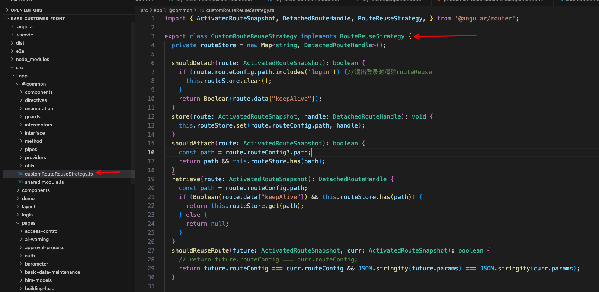

# angular route reuse strategy (angular 路由复用策略)

### 改变路由，从一个组件 navaigate 到另一个组件，这个过程发生了什么？

比如现在路由是/pathA，DOM 里渲染了组件 A，当路由切到/pathB…..

- 组件 A 被销毁（ngOnDestroy 被调用）：从 DOM 里移除组件 A，删除组件实例。
- 组件 B 被初始化（ngOnInit 被调用）：初始化组件 B，渲染在 dom 里

### 问题：

组件初始化和销毁，组件 js 会重新执行一遍，dom 也会重新渲染，如果组件比较复杂，那么页面渲染体验就会比较差。
另外，从列表页跳转别的页面后再返回列表页，列表页还需要保持跳转前的状态，怎么实现？

### 方案：

路由跳转时，不销毁当前的组件，而是将当前的组件保存起来，下次重复使用。
如何实现？-- 使用 Angular Route Reuse Strategies

### Angular Route Reuse Strategies 做了什么？

将组件实例存在某个地方，而不是销毁它。
当重新访问此路由，会重复使用该组件实例，而不是重新创建个新组件。

### angular 默认的行为

angular 默认不会存储任何组件实例，除非要跳转的路由和当前路由一致。所以 angular 一直在销毁和创建组件。
我们可以重写 RouteReuseStrategy 来定义自己的 reuse 规则。

### 如何重写 RouteReuseStrategy？

写一个类，继承 RouteReuseStrategy 抽象类，重写里边的方法：

1. shouldDetach
   > @param1 — ActivatedRouteSnapshot
   > returnType-boolean

- 当离开当前组件时，此方法会被调用，判断是否存储当前组件实例（而不是销毁）
- 参数 ActivatedRouteSnapshot 包含 route 详情；return true 表示不销毁，false 表示销毁

2. store
   > @param1 — ActivatedRouteSnapshot ,
   > @param2 — DetachedRouteHandle ,
   > returnType-boolean

- 当`shouldDetach`返回`true`，此方法将被调用，我们可以在此方法中写自己的逻辑来保存组件实例
- 参数 ActivatedRouteSnapshot 包含 route 详情；参数 DetachedRouteHandle 可以拿到当前组件实例
- 推荐将 route path 和 相应的组件实例 以 key-value 的形式存储，方便在其他方法中使用

**上面两个方法都是针对即将离开的组件，让它不销毁而是存起来**

**下面两个方法将是针对即将要加载的组件，让它不重新创建而是复用存储的组件**

3. shouldAttach
   > @param1 — ActivatedRouteSnapshot
   > returnType-boolean

- 这个方法用来判断即将要加载的组件是否复用已存储的组件
- return true 表示复用，false 表示不复用

4. retrieve
   > @param1 — ActivatedRouteSnapshot
   > returnType-DetachedRouteHandle

- 当`shouldAttach`返回`true`时，此方法将被调用，我们可以在此方法中找到在`store()`方法中存储的当前路由（从参数 ActivatedRouteSnapshot 中获取）对应的组件并 return

5. shouldReuseRoute
   此方法用来决定路由是否复用，每次路由变化都会调用，如果返回 true，则不进行跳转，如果返回 false，就会跳转并且执行上边的四个方法。

---

具体实现：

- 新建一个 class，implement RouteReuseStrategy
  
- 按照业务需求，重写以上各个方法
- 告诉 angular 用新的 class 作为复用策略，在 app.module.ts 的 providers 里增加：

```js
providers: [
    {
    provide: RouteReuseStrategy,
    useClass: CustomRouteReuseStrategy,
    },
 ],
```

---

贴上代码：

```ts
import { ActivatedRouteSnapshot, DetachedRouteHandle, RouteReuseStrategy, } from '@angular/router';

export class CustomRouteReuseStrategy implements RouteReuseStrategy {
  private routeStore = new Map<string, DetachedRouteHandle>();

  shouldDetach(route: ActivatedRouteSnapshot): boolean {
    if (route.routeConfig.path.includes('login')) {//退出登录时清除routeReuse
      this.routeStore.clear();
    }
    return Boolean(route.data["keepAlive"]);
  }
  store(route: ActivatedRouteSnapshot, handle: DetachedRouteHandle): void {
    this.routeStore.set(route.routeConfig.path, handle);
  }
  shouldAttach(route: ActivatedRouteSnapshot): boolean {
    const path = route.routeConfig?.path;
    return path && this.routeStore.has(path);
  }
  retrieve(route: ActivatedRouteSnapshot): DetachedRouteHandle {
    const path = route.routeConfig.path;
    if (Boolean(route.data["keepAlive"]) && this.routeStore.has(path)) {
      return this.routeStore.get(path);
    } else {
      return null;
    }
  }
  shouldReuseRoute(future: ActivatedRouteSnapshot, curr: ActivatedRouteSnapshot): boolean {
    // return future.routeConfig === curr.routeConfig;
    return future.routeConfig === curr.routeConfig && JSON.stringify(future.params) === JSON.stringify(curr.params);
  }
```
