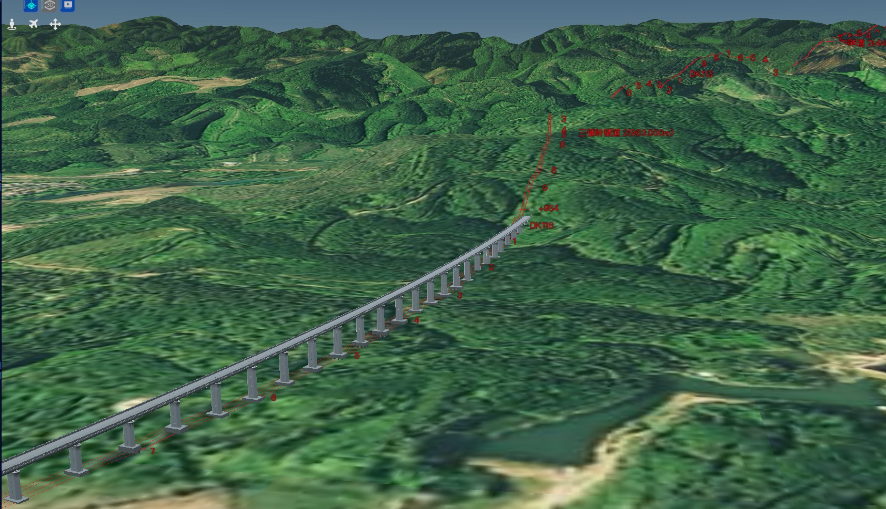
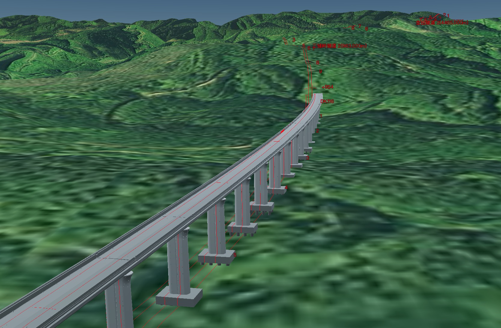
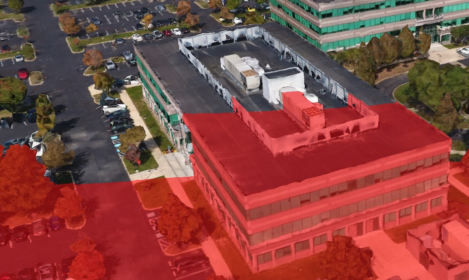
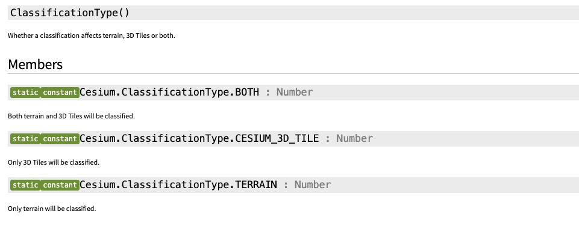

# cesium的矢量图形（如kml、geojson）设置贴地但不要覆盖3dtiles的方法
## 先上解决方案：
1. kml/geojson加载时添加`clampToGround: true`参数使其贴地
2. 加载完成后设置其中的entity中（billboard、polyline、polygon等）的`classificationType`为`Cesium.ClassificationType.TERRAIN`

以下以kml为例，贴出关键代码
```js
 let dataSource = Cesium.KmlDataSource.load('./line.ovkml',
    {
        camera: viewer.scene.camera,
        canvas: viewer.scene.canvas,
        clampToGround: true, //kml设置贴地
    });
   viewer.dataSources.add(dataSource).then(data => {
        data.entities.values.map(e => {
            //设置classificationType为Cesium.ClassificationType.TERRAIN
            if (Cesium.defined(e.billboard)) {
              e.billboard.classificationType = Cesium.ClassificationType.TERRAIN;
            }
            else if (Cesium.defined(e.polyline)) {
              e.polyline.classificationType = Cesium.ClassificationType.TERRAIN;
            }
            else if (Cesium.defined(e.polygon)) {
              e.polygon.classificationType = Cesium.ClassificationType.TERRAIN;
            }
          //其他元素
          //else if
          })
   });
```
效果：



## 背景
需求1: cesium上的矢量图形（如上图中红色的kml）要求始终在地面上方可见，不受地形影响（贴地）。
解决：kml/geojson加载时添加`clampToGround: true`参数

需求2: 同时要求3dtiles模型（如上图中的灰色桥梁）`不被kml覆盖`。
问题出现：cesium同时加载贴地的kml和3dtiles默认的效果如下图：

不得不说设置了贴地的kml很敬业，辛辛苦苦爬到地形之上，连3dtiles都不放过，但很明显，桥被红线包围肯定是影响观感的。
不过确实有很多的使用场景适合这样的效果，比如下图这样的：3dtiles上加一层覆盖。

所以，需要找到办法既让kml贴地，又不让它覆盖3dtiles。于是找到了`classificationType`


## classificationType详解
entity的billboard、polyline、polygon等元素都包含一个属性：`classificationType`

> classificationType表示这些元素的显示范围：terrain地形和3dtile瓦片图，仅3dtile瓦片图、仅terrain地形。
默认值是ClassificationType.BOTH，所以会出现上面背景里描述的样子，默认情况下，kml线条在地形和瓦片模型上都显示了。

了解到这个属性后，解决思路就比较清晰了：加载kml时，将kml里上述这些元素的classificationType设置成显示范围仅在terrain地形上,即：(更多代码见顶部的"解决方案")
```js
   e.billboard.classificationType = Cesium.ClassificationType.TERRAIN;
   e.polyline.classificationType = Cesium.ClassificationType.TERRAIN;
   e.polygon.classificationType = Cesium.ClassificationType.TERRAIN;
```

ceisum官方沙盘中也提供了一个例子：[点我看例子](https://sandcastle.cesium.com/?src=Classification%20Types.html&label=All)